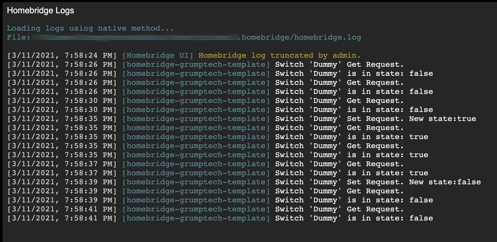

# Homebridge Template

This project is intended to serve as a template for creating a plugin for Homebridge to create home made accessories to Homekit 
Users should feel free to use this as a launching point to develop their own plugins. 
Please remember to go over all the files and change all important data, expecially references back to the github project for these files.

## New to Homebridge
For those new to homebridge and making _home made_ plugins, it is easiest to install the _homebridge-config-ui-x_ module from the _npm_ package manager.
1. Follow instructions from [npmjs.org](https://docs.npmjs.com/downloading-and-installing-node-js-and-npm)
2. Once _npm & node.js_ are installed, install and configure the [_homebridge-config-ui-x_](https://www.npmjs.com/package/homebridge-config-ui-x) module.

## Verify and configure the template
1. The _homebridge-grumptech-template_ plugin supports a dummy switch that should work _out of the box_. Once _homebridge-config-ui-x_ is configured and running, you can install this template as a plugin. However, since this templage is largly useless, it is intentionally not released into the npm package management system.
     1. Clone this repository to your local system, if not already done
     2. From the commandline, change the current directory to the folder with this template
     3. Install all the node modules required for development.
          1. Enter the following on the command line: `npm install`
          2. Verify that an updated version of `./dist/homebridge-grumptech-template.js` is generated.
     4. _Install_ this module into the global node modules
          1. Enter the following on the command line: `npm link`
     5. Open and log into the _homebridge_config_ui_x_ screen with your browser
     6. Visit the _Plugins_ page and you should see a plugin for _homebridge_grumptech_template_
 

     7. Enable the _Homebridge Template_ plugin as an isolated child bridge.
          1. Click the wrench in the lower-right of the plugin and select `Bridge Settings`
 

          2. Activate the slider control to run `GrumpTechHomebridgeTemplate` as a _child bridge_
 

          3. Save the changes and restart homebridge.
          4. If you wish to add this plugin to your Apple Home, then revisit the bridge settings to view the QR code. Add an accessory to your Apple Home and scan the QR code.
 

4. You shoud now be able to verify that toggling the `Dummy` switch prints out a a status on the homebridge log.
     1. Using either the accessory that was added to your Apple Home or visiting the `Accessories` page of the _homebridge-config-ui-x_ control and toggle the switch. Then check for the results.
 

## Let your immagination run wild
Have fun and see what you can create. As you make changes, you can run `npm run build` to _compile_ the code into a deploy-able script. You will need to restart the plugin child bridge via the _homebridge-config-ui-x_ user interface for the upates to take effect.

## Cleanup Before Deploy
Before releasing your creation publicly to `npm`, `github`, etc - Please go through all files and remove and rename files as approptiate. Some items to take care of are:
1. Delete all references to my github account and reposotories.
2. Delete the `template_assets` folder and contents
3. Delete `README.md`
4. Rename `README_plugin.md` to `README.md`
5. Update `README.md` and `CHANGELOG.md` as necessary.
5. Decide on what licence model you want to use for your creation and update `LICENSE.md` as appropriate. Even if you want to stick with the ISC license, change the header text for the correct year, your name, and plugin name.
